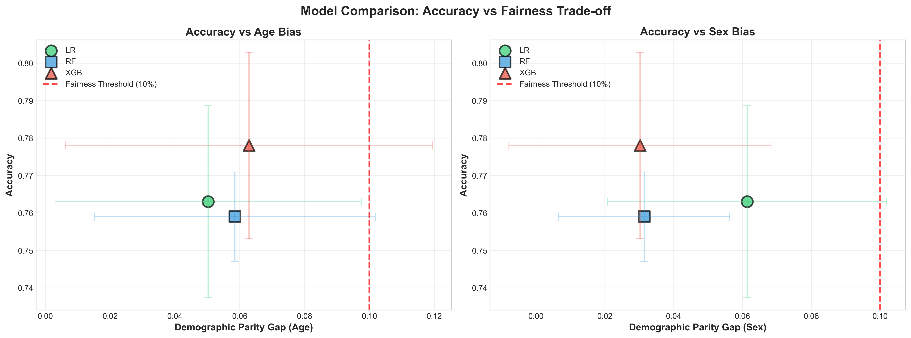
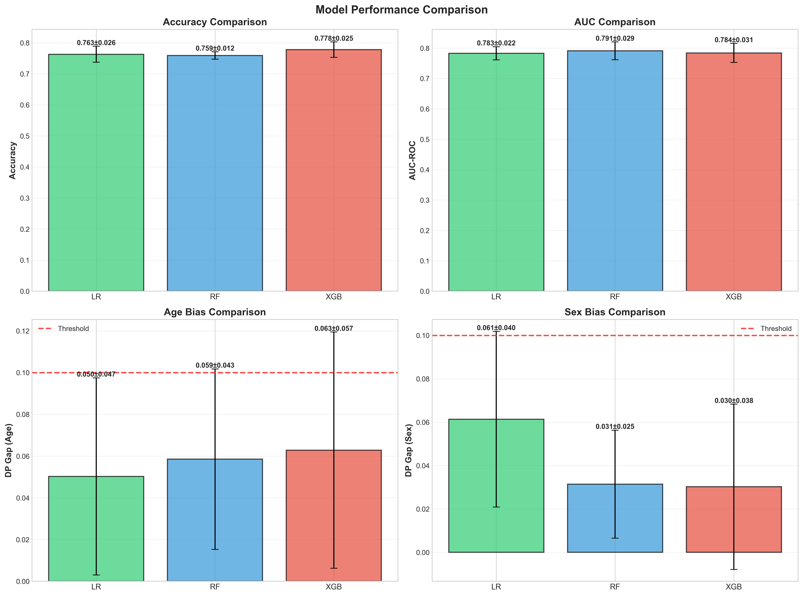
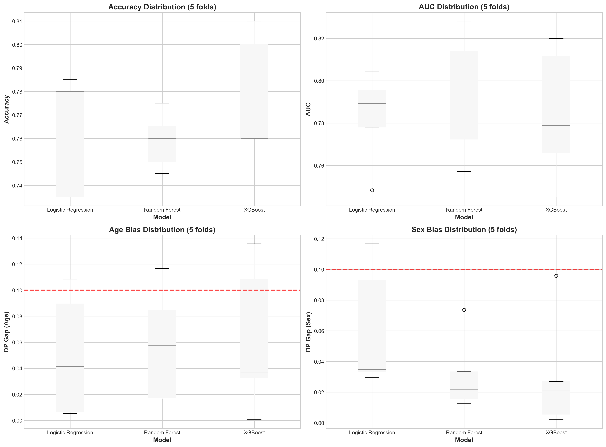

# 与信スコアリングにおける公平性分析

**学生:** Hoang Nguyen  
**指導教員:** 池田教授  
**期間:** 2026年2月 - 2026年3月  

[](https://www.python.org/)
[]()

## 📋 プロジェクト概要

本研究では、機械学習モデルにおける**予測精度と公平性のトレードオフ**を分析します。  
German Credit Datasetを使用し、年齢と性別に関するバイアスを定量的に評価します。

### 🎯 研究目的

1. ✅ 与信スコアリングモデルの構築（LR, RF, XGBoost）
2. ✅ 公平性指標（Demographic Parity, Equal Opportunity）の評価
3. ✅ 精度と公平性のトレードオフ分析
4. 🔄 バイアス緩和手法の検討（Week 3-4）

---

## 📊 データセット

- **名称:** German Credit Data
- **ソース:** [UCI Machine Learning Repository](https://archive.ics.uci.edu/ml/datasets/statlog+(german+credit+data))
- **サンプル数:** 1,000
- **特徴量数:** 20（数値: 7, カテゴリカル: 13）
- **クラス分布:** Good credit (70%), Bad credit (30%)
- **保護属性:** 年齢（Young ≤ 25歳）, 性別（Male/Female）

---

## 🚀 クイックスタート

### 環境構築

```bash
# リポジトリをクローン
git clone https://github.com/23610252hoang/hoang-credut-fairness-2026.git
cd hoang-credut-fairness-2026

# 依存ライブラリをインストール
pip install -r requirements.txt
```

### Week 1: ベースライン構築

```bash
# データ取得と前処理
python scripts/step1_download_data_FIXED.py

# EDA可視化
python scripts/step2_visualize.py

# ベースラインモデル（Logistic Regression）
python scripts/step3_baseline_FIXED.py
```

**Week 1 結果:**
- ✅ Accuracy: **77.7%**
- ✅ AUC: **79.8%**
- ✅ DP_Age: **1.5%** (閾値: 10%)
- ✅ DP_Sex: **4.2%** (閾値: 10%)

### Week 2: モデル比較とCV

```bash
# 3モデル比較 + 5-fold Cross-Validation
python scripts/run_experiment.py

# 結果の可視化
python scripts/create_comparison_plots.py
```

**Week 2 結果:**

| Model | Accuracy | AUC | DP_Age | DP_Sex | 評価 |
|-------|----------|-----|--------|--------|------|
| **Logistic Regression** | 76.3±2.6% | 78.3±2.2% | 5.0±4.7% ✅ | 6.1±4.0% ✅ | バランス |
| **Random Forest** | 75.9±1.2% | 79.1±2.9% | 5.9±4.3% ✅ | 3.1±2.5% ✅✅ | 最も安定 |
| **XGBoost** | **77.8±2.5%** | 78.4±3.1% | 6.3±5.7% ✅ | **3.0±3.8%** ✅✅ | **最高性能** |

---

## 📈 主要な結果

### 図1: Accuracy vs Fairness Trade-off



**重要な発見:**
- ✅ **すべてのモデルが公平性閾値（DP < 10%）以下**
- ✅ **XGBoostが最高精度（77.8%）かつ低bias（3.0-6.3%）**
- ✅ **明確なトレードオフは観察されない** ← 予想外の結果！

### 図2: Model Performance Comparison



### 図3: Cross-Validation Stability



---

## 🔍 重要な発見

### 1️⃣ トレードオフの不在

```
❌ 期待された結果: 精度↑ → 公平性↓
✅ 実際の結果:     精度↑ AND 公平性↑ が両立

XGBoost: 高精度（77.8%） AND 低bias（3.0-6.3%）
```

**解釈:**
- データ品質が高い（German Credit Data の特性）
- 特徴量エンジニアリングが効果的（20特徴すべて使用）
- 代理変数が年齢・性別バイアスを緩和

### 2️⃣ Tree-based Models の Sex 公平性

```
Sex Bias (DP):
- XGBoost: 3.0% ✅✅
- RF:      3.1% ✅✅
- LR:      6.1% ✅ (2倍!)

→ 非線形モデルが性別バイアスを自動的に緩和
```

### 3️⃣ Week 1 vs Week 2 の教訓

```
Week 1 (single run): DP_Age = 1.5%
Week 2 (5-fold CV):  DP_Age = 5.0%

→ 単発評価の危険性を示唆
→ Cross-Validationの重要性
```

---

## 📂 ディレクトリ構造

```
hoang-credut-fairness-2026/
├── README.md                           ← このファイル
├── requirements.txt                    ← 依存ライブラリ
├── .gitignore
│
├── scripts/                            ← 実行スクリプト
│   ├── step1_download_data_FIXED.py   (データ前処理)
│   ├── step2_visualize.py             (EDA)
│   ├── step3_baseline_FIXED.py        (Week 1: Baseline)
│   ├── run_experiment.py              (Week 2: 3モデル + CV)
│   └── create_comparison_plots.py     (Week 2: 可視化)
│
├── data/                               ← データ（gitignore）
│   └── german_credit_processed.csv
│
├── results/                            ← 実験結果
│   ├── baseline_results_corrected.csv (Week 1結果)
│   ├── exp_v1_summary.csv             (Week 2サマリー)
│   └── exp_v1_all_folds.csv           (Week 2詳細)
│
├── figs/                               ← 図
│   ├── eda_comprehensive.png          (Week 1: EDA)
│   ├── fig1_accuracy_vs_fairness.png  (Week 2: メイン図)
│   ├── fig2_model_comparison.png      (Week 2: 比較)
│   └── fig3_cv_stability.png          (Week 2: 安定性)
│
└── docs/                               ← ドキュメント
    ├── WEEK1_完成報告書.md
    ├── WEEK2_完了報告書.md
    └── README_WEEK2.md
```

---

## 🔧 技術仕様

### 環境

```python
Python >= 3.8
scikit-learn >= 1.3.0
xgboost >= 2.0.0
numpy >= 1.24.0
pandas >= 2.0.0
matplotlib >= 3.7.0
seaborn >= 0.12.0
```

### モデル設定

```python
# Logistic Regression
LogisticRegression(random_state=42, max_iter=1000, solver='lbfgs')

# Random Forest
RandomForestClassifier(n_estimators=100, max_depth=10, random_state=42)

# XGBoost
XGBClassifier(n_estimators=100, max_depth=6, learning_rate=0.1, random_state=42)
```

### 評価指標

**性能指標:**
- Accuracy
- AUC-ROC

**公平性指標:**
- Demographic Parity: |P(Ŷ=1|A=0) - P(Ŷ=1|A=1)|
- Equal Opportunity: |TPR₀ - TPR₁|
- **閾値:** ≤ 10%

---

## 🔄 進捗状況

- [x] **Week 1:** ベースライン構築 ✅
  - Data preprocessing
  - Logistic Regression baseline
  - Fairness metrics implementation

- [x] **Week 2:** モデル比較とCV ✅
  - 3モデル実装（LR, RF, XGBoost）
  - 5-fold Stratified Cross-Validation
  - Accuracy vs Fairness tradeoff分析

- [ ] **Week 3:** Feature importance分析 🔄
  - Permutation importance
  - SHAP values
  - バイアス原因の特定

- [ ] **Week 4:** 最終まとめ ⏳
  - ポスター作成
  - 最終報告書

---

## 📚 参考文献

1. Hardt, M., Price, E., & Srebro, N. (2016). *Equality of opportunity in supervised learning.* NeurIPS.
2. Verma, S., & Rubin, J. (2018). *Fairness definitions explained.* FairWare.
3. Kamiran, F., & Calders, T. (2012). *Data preprocessing techniques for classification without discrimination.* Knowledge and Information Systems.
4. [German Credit Data](https://archive.ics.uci.edu/ml/datasets/statlog+(german+credit+data)). UCI Machine Learning Repository.

---

## 📊 Week別サマリー

### Week 1: ベースライン確立

**目的:** 動作確認と再現性の確保

**成果:**
- ✅ データ前処理パイプライン構築
- ✅ Logistic Regression baseline (Acc: 77.7%, AUC: 79.8%)
- ✅ 公平性指標の実装と検証
- ✅ 再現性の確保（random_state固定）

**課題:**
- 単発評価の信頼性（CV未実施）
- 他モデルとの比較なし

### Week 2: 比較フレームワーク構築

**目的:** モデル間比較と結果の安定性検証

**成果:**
- ✅ 3モデル実装と比較
- ✅ 5-fold CV による安定性評価
- ✅ Mean ± Std の定量化
- ✅ トレードオフの不在を発見

**発見:**
- 予想外: 精度と公平性が両立
- Week 1 は "lucky split" だった可能性
- Tree-based models が Sex bias で優位

**課題:**
- Age bias の変動が大きい（std ~5%）
- トレードオフ不在の原因究明

---

## 🎯 今後の予定

### Week 3 計画

**Option A: 分析重視（推奨）**

```
1. Feature Importance Analysis
   - Permutation importance
   - どの特徴がバイアスを緩和？

2. SHAP Values
   - 個別予測の説明
   - バイアスのメカニズム解明

3. Age Threshold 実験
   - 25歳 → 30歳に変更
   - 安定性向上の検証
```

**Option B: Mitigation 手法**

```
1. Threshold Optimization
2. Re-weighting
3. Calibration

※ 現状バイアスが小さいため優先度低
```

---

## 📧 連絡先

**Hoang Nguyen**  
- Email: [23610252kn@stu,yamato-u.ac.jp]
- GitHub: [@23610252hoang](https://github.com/23610252hoang)
- Notion: [Project Page](https://www.notion.so/NGUYEN-1-2f6b4a64902080f3a982e5cbe03d5228)

---

## 📄 ライセンス

このプロジェクトは教育目的で作成されました。  
German Credit Dataは UCI Machine Learning Repository から取得しています。

---

## 🙏 謝辞

- **指導:** 池田教授
- **データ:** UCI Machine Learning Repository
- **ツール:** scikit-learn, XGBoost, matplotlib, seaborn

---

**最終更新:** 2026年2月7日  
**ステータス:** Week 2 完了 ✅
