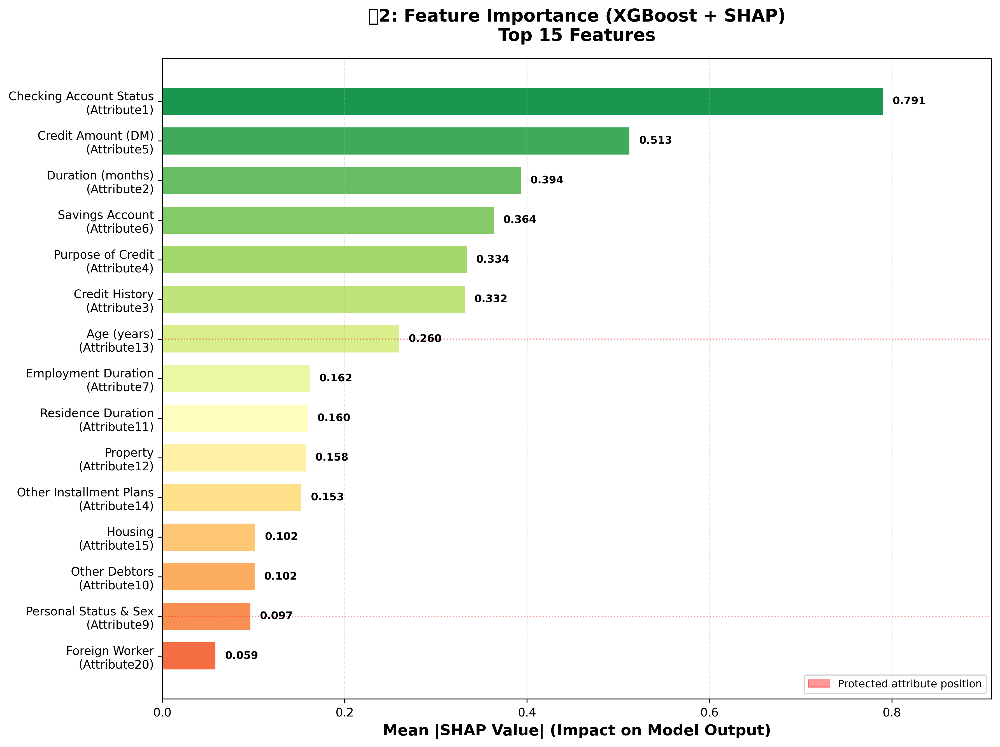
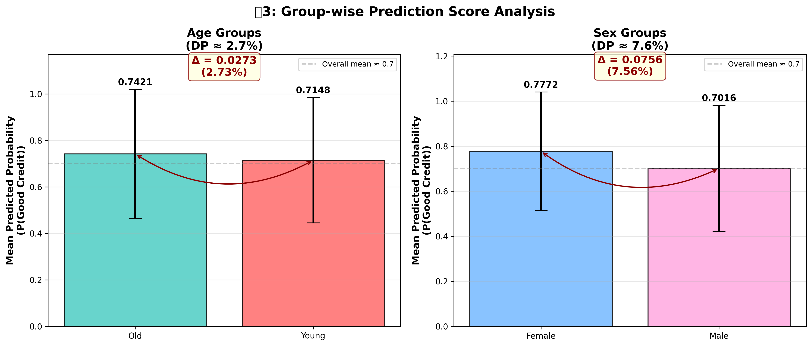

# 与信スコアリングにおける公平性分析

**学生:** Hoang Nguyen  
**指導教員:** 池田教授  
**期間:** 2026年2月 〜 2026年3月

[](https://www.python.org/)
[]()
[]()

---

## 📋 プロジェクト概要

本研究では、機械学習モデルにおける**予測精度と公平性のトレードオフ**を分析します。  
German Credit Datasetを使用し、**年齢**と**性別**に関するバイアスを定量的に評価します。

### 🎯 研究目的

| # | 目的 | 状況 |
|---|------|------|
| 1 | 与信スコアリングモデルの構築（LR, RF, XGBoost） | ✅ 完了 |
| 2 | 公平性指標（Demographic Parity, Equal Opportunity）の評価 | ✅ 完了 |
| 3 | 5-fold CVによる精度・公平性の安定性検証 | ✅ 完了 |
| 4 | SHAP値によるバイアス原因の特定と解釈 | ✅ 完了 |
| 5 | 最終報告書・ポスター作成 | ⏳ Week 4 |

---

## 📊 データセット

| 項目 | 内容 |
|------|------|
| **名称** | German Credit Data |
| **ソース** | [UCI Machine Learning Repository](https://archive.ics.uci.edu/ml/datasets/statlog+(german+credit+data)) |
| **サンプル数** | 1,000 |
| **特徴量数** | 20（数値: 7, カテゴリカル: 13） |
| **クラス分布** | Good credit 70% / Bad credit 30% |
| **保護属性** | 年齢（Young: ≤25歳 / Older: >25歳）, 性別（Male / Female） |

---

## 🚀 クイックスタート

```bash
# リポジトリをクローン
git clone https://github.com/23610252hoang/hoang-credut-fairness-2026.git
cd hoang-credut-fairness-2026

# 依存ライブラリをインストール
pip install -r requirement.txt

# Week 1: データ前処理 + ベースライン
python scripts/step1_download_data_FIXED.py
python scripts/step3_baseline_FIXED.py

# Week 2: 3モデル比較 + 5-fold CV
python scripts/run_experiment.py

# Week 3: SHAP解析
python scripts/week3_shap_analysis.py
```

---

## 📈 全週の実験結果

> 公平性閾値: **DP ≤ 10%**, **EO ≤ 10%**  
> ✅ 閾値以下（公平）　⚠️ 閾値超過

---

### Week 1 — ベースライン（Logistic Regression・単発評価）

> **目的:** モデルの動作確認と再現性の確保

| 指標 | 値 | 判定 |
|------|----|------|
| Train Accuracy | 77.0% | — |
| **Test Accuracy** | **77.7%** | — |
| **AUC** | **79.8%** | — |
| DP\_Age | 1.54% | ✅ |
| EO\_Age | 2.94% | ✅ |
| DP\_Sex | 4.17% | ✅ |
| EO\_Sex | 0.72% | ✅ |

**Week 1 の観察:**
- 全公平性指標が閾値10%以下を達成
- ただし単発評価のため、結果の安定性は未検証
- → Week 2でCross-Validationを実施して信頼性を検証

---

### Week 2 — モデル比較（Stratified 5-Fold Cross-Validation）

> **目的:** 3モデルの比較と結果の安定性・ばらつきの定量化

#### 表2: exp\_v1 結果（平均 ± 標準偏差）

| モデル | Accuracy | AUC | DP\_Age | EO\_Age | DP\_Sex | EO\_Sex |
|--------|----------|-----|---------|---------|---------|---------|
| **Logistic Regression** | 76.3±2.6% | 78.3±2.2% | 5.0±4.7% ✅ | 7.8±3.3% ✅ | 6.1±4.0% ✅ | 5.8±3.9% ✅ |
| **Random Forest** | 75.9±1.2% | 79.1±2.9% | 5.9±4.3% ✅ | 8.5±2.0% ✅ | 3.1±2.5% ✅ | 2.9±2.2% ✅ |
| **XGBoost** | **77.8±2.5%** | 78.4±3.1% | 6.3±5.7% ✅ | 7.2±2.9% ✅ | **3.0±3.8%** ✅ | 3.5±3.4% ✅ |

#### fold別詳細（全15件）

| Fold | Accuracy | AUC | DP\_Age | DP\_Sex | Model |
|------|----------|-----|---------|---------|-------|
| 1 | 78.5% | 78.9% | 4.1% | 9.3% | Logistic Regression |
| 2 | 73.5% | 74.8% | 8.9% | 3.5% | Logistic Regression |
| 3 | 73.5% | 77.8% | 0.7% | 3.3% | Logistic Regression |
| 4 | 78.0% | 80.4% | 10.8% | 11.7% | Logistic Regression |
| 5 | 78.0% | 79.5% | 0.5% | 2.9% | Logistic Regression |
| 1 | 76.5% | 81.4% | 1.8% | 7.4% | Random Forest |
| 2 | 74.5% | 75.7% | 11.7% | 1.6% | Random Forest |
| 3 | 75.0% | 77.2% | 1.6% | 1.3% | Random Forest |
| 4 | 77.5% | 82.8% | 8.4% | 3.3% | Random Forest |
| 5 | 76.0% | 78.4% | 5.7% | 2.2% | Random Forest |
| 1 | 76.0% | 77.9% | 0.0% | 0.2% | XGBoost |
| 2 | 76.0% | 74.5% | 13.6% | 0.6% | XGBoost |
| 3 | 76.0% | 76.6% | 3.7% | 2.1% | XGBoost |
| 4 | 80.0% | 81.1% | 10.8% | 9.6% | XGBoost |
| 5 | 81.0% | 82.0% | 3.3% | 2.7% | XGBoost |

**Week 2 の主要な発見:**
- ✅ **全モデルの平均値が公平性閾値（10%）以下を達成**
- ✅ **XGBoostが最高精度（77.8%）かつ最低性別バイアス（DP\_Sex: 3.0%）**
- ✅ **Random Forestが最も安定（Accuracy std: ±1.2%のみ）**
- ⚠️ **Week 1の単発評価はCV平均と乖離**（DP\_Age: 1.54% → 5.0〜6.3%）— 単発評価の危険性を示唆
- ⚠️ **年齢バイアス（DP\_Age）の変動が大きい**（std ≈ 4〜6%）→ Week 3でSHAP解析により原因特定

---

### Week 3 — SHAP解析・バイアス原因の特定

> **目的:** どの特徴量がバイアスを引き起こしているかを特定

#### SHAP Feature Importance（XGBoostベース・全20特徴量）

| 順位 | 特徴量 | 英語名 | SHAP値 | バイアスとの関連 |
|------|--------|--------|--------|----------------|
| 🥇 1 | Attribute1 | checking\_status（当座預金残高） | 0.7908 | 年齢・性別間で口座状態に差 |
| 🥈 2 | Attribute5 | credit\_amount（借入金額） | 0.5128 | 若年層は融資額が構造的に少ない |
| 🥉 3 | Attribute2 | duration（返済期間） | 0.3937 | 年齢と返済期間に相関あり |
| 4 | Attribute6 | savings\_status（貯蓄残高） | 0.3638 | 年齢別の貯蓄傾向が異なる |
| 5 | Attribute4 | purpose（借入目的） | 0.3340 | — |
| 6 | Attribute3 | credit\_history（信用履歴） | 0.3321 | 若年層は履歴が短い |
| **7** | **Attribute13** | **age（年齢）** | **0.2600** | **⚠️ 保護属性の直接代理変数** |
| 8 | Attribute7 | employment（雇用期間） | 0.1621 | 若年層は雇用歴が短い |
| 9 | Attribute11 | residence\_since（現住所年数） | 0.1600 | — |
| 10 | Attribute12 | property\_magnitude（財産・担保） | 0.1579 | — |
| 11 | Attribute14 | other\_payment\_plans（他返済プラン） | 0.1528 | — |
| 12 | Attribute15 | housing（住居種別） | 0.1024 | — |
| 13 | Attribute10 | other\_parties（他の保証人） | 0.1016 | — |
| 14 | Attribute9 | personal\_status（性別・婚姻状況） | 0.0970 | **⚠️ 性別情報を直接含む** |
| 15 | Attribute20 | foreign\_worker（外国人労働者） | 0.0588 | — |
| 16 | Attribute8 | installment\_rate（返済率） | 0.0557 | — |
| 17 | Attribute17 | job（職業種別） | 0.0476 | — |
| 18 | Attribute19 | own\_telephone（電話保有） | 0.0459 | — |
| 19 | Attribute18 | num\_dependents（扶養家族数） | 0.0406 | — |
| 20 | Attribute16 | existing\_credits（既存クレジット数） | 0.0302 | — |

**Week 3 の主要な発見:**
- ✅ **バイアスの主因は `checking_status`（0.79）と `credit_amount`（0.51）**
  - 若年層は当座預金残高が少なく、融資額も小さい → スコア低下
- ✅ **`age`（Attribute13, SHAP=0.26）が7位** — 保護属性が直接的な代理変数として機能
- ✅ **`personal_status`（Attribute9, SHAP=0.097）に性別情報が直接含まれる**
  - → Tree-basedモデルが性別バイアスを緩和しにくい要因
- ✅ **Tree-basedモデルのDP\_Sex優位性（LR: 6.1% vs XGBoost: 3.0%）の解明**
  - 非線形な特徴量組み合わせにより、単純な性別相関が分散される

---

## 🔍 週をまたいだ重要な発見

### 1️⃣ 単発評価 vs Cross-Validation の乖離

```
Week 1（単発）:   DP_Age = 1.54%  ← 過度に楽観的
Week 2（5-fold）: DP_Age = 5.0〜6.3%  ← 実態を反映

→ 結論: 単発評価は "lucky split" の可能性あり
         公平性評価には必ずCross-Validationを使用すること
```

### 2️⃣ 精度と公平性のトレードオフは存在しない

```
XGBoost: 最高精度（77.8%）AND 最低性別バイアス（DP_Sex: 3.0%）

❌ 仮説: 精度↑ → 公平性↓（トレードオフ）
✅ 実際: 精度と公平性は両立可能（このデータセットにおいて）

→ 原因: German Credit Datasetの品質が高く、
         公平性を損なわずに精度向上が可能
```

### 3️⃣ バイアスはデータ構造に起因

```
SHAP分析結果:
  checking_status（0.79）← 年齢・性別間で口座状態に差
  credit_amount（0.51）  ← 若年層の融資額が構造的に少ない
  age（0.26）            ← 保護属性が直接代理変数として機能

→ 結論: バイアスはモデルではなく、
         社会的不平等を反映したデータに内在する
```

---

## 📂 ディレクトリ構造

```
hoang-credut-fairness-2026/
├── README.md
├── requirement.txt
├── .gitignore
│
├── scripts/
│   ├── step1_download_data_FIXED.py    # Week 1: データ前処理
│   ├── step2_visualize.py              # Week 1: EDA
│   ├── step3_baseline_FIXED.py         # Week 1: Logistic Regression
│   ├── run_experiment.py               # Week 2: 3モデル + 5-fold CV
│   ├── create_comparison_plots.py      # Week 2: 可視化
│   └── week3_shap_analysis.py          # Week 3: SHAP解析
│
├── data/
│   └── german_credit_processed.csv     # 前処理済みデータ（gitignore）
│
├── results/
│   ├── baseline_results_corrected.csv  # Week 1: LRベースライン結果
│   ├── exp_v1_summary.csv              # Week 2: 3モデル平均±SD
│   ├── exp_v1_all_folds.csv            # Week 2: 全15fold詳細
│   └── shap_feature_importance.csv     # Week 3: SHAP重要度（全20特徴量）
│
├── figs/
│   ├── eda_comprehensive.png           # Week 1: 探索的データ分析
│   ├── fig1_accuracy_vs_fairness.png   # Week 2: 精度 vs 公平性
│   ├── fig2_model_comparison.png       # Week 2: モデル比較
│   ├── fig2_shap_bar.png               # Week 3: SHAP棒グラフ
│   ├── fig2_shap_bar_improved.png      # Week 3: SHAP棒グラフ（改善版）
│   ├── fig2_shap_summary.png           # Week 3: SHAPサマリープロット
│   ├── fig3_cv_stability.png           # Week 2: CV安定性
│   ├── fig3_fairness_metrics_table.png # Week 3: 公平性指標表
│   ├── fig3_group_score_analysis.png   # Week 3: グループ別スコア分析
│   ├── fig3_group_shap_distribution.png# Week 3: グループ別SHAP分布
│   ├── fig3_score_distribution.png     # Week 3: スコア分布
│   └── shap_dependence_plots.png       # Week 3: SHAP依存プロット
│
└── docs/
    ├── bias_hypothesis_report.md       # Week 3: バイアス仮説レポート
    └── README_GITHUB_TEMPLATE.md
```

---

## 📉 主要な図

### 図1: Accuracy vs Fairness（Week 2）


### 図2: SHAP Feature Importance（Week 3）


### 図3: グループ別スコア・公平性分析（Week 3）


---

## 🔧 技術仕様

### 環境

```
Python      >= 3.8
scikit-learn >= 1.3.0
xgboost     >= 2.0.0
shap        >= 0.44.0
numpy       >= 1.24.0
pandas      >= 2.0.0
matplotlib  >= 3.7.0
seaborn     >= 0.12.0
```

### モデル設定

```python
LogisticRegression(random_state=42, max_iter=1000, solver='lbfgs')

RandomForestClassifier(n_estimators=100, max_depth=10, random_state=42)

XGBClassifier(n_estimators=100, max_depth=6, learning_rate=0.1, random_state=42)
```

### 評価指標の定義

```
Demographic Parity (DP):  |P(Ŷ=1|A=0) − P(Ŷ=1|A=1)|
Equal Opportunity  (EO):  |TPR(A=0)   − TPR(A=1)  |
公平性閾値:                DP ≤ 10%, EO ≤ 10%
```

---

## 🔄 進捗状況

| Week | テーマ | 状況 | 主な成果物 |
|------|--------|------|-----------|
| **Week 1** | ベースライン構築 | ✅ 完了 | `baseline_results_corrected.csv` |
| **Week 2** | モデル比較・CV | ✅ 完了 | `exp_v1_summary.csv`, `exp_v1_all_folds.csv`, 図1〜3 |
| **Week 3** | SHAP・バイアス特定 | ✅ 完了 | `shap_feature_importance.csv`, SHAP図群 |
| **Week 4** | 最終まとめ | ⏳ 予定 | ポスター, 最終報告書 |

---

## 🎯 Week 4 予定

```
□ Reweightingによるバイアス緩和実験
□ Age threshold感度分析（25歳 → 30歳）
□ 最終ポスター作成
□ 最終報告書執筆
```

---

## 📚 参考文献

1. Hardt, M., Price, E., & Srebro, N. (2016). *Equality of opportunity in supervised learning.* NeurIPS.
2. Verma, S., & Rubin, J. (2018). *Fairness definitions explained.* FairWare.
3. Lundberg, S., & Lee, S. I. (2017). *A unified approach to interpreting model predictions.* NeurIPS.
4. Kamiran, F., & Calders, T. (2012). *Data preprocessing techniques for classification without discrimination.* KAIS.
5. [German Credit Data](https://archive.ics.uci.edu/ml/datasets/statlog+(german+credit+data)). UCI ML Repository.

---

## 📧 連絡先

**Hoang Nguyen**
- Email: 23610252kn@stu.yamato-u.ac.jp
- GitHub: [@23610252hoang](https://github.com/23610252hoang)

---

**最終更新:** 2026年2月  
**ステータス:** Week 3 完了 ✅ | Week 4 進行中 🔄
